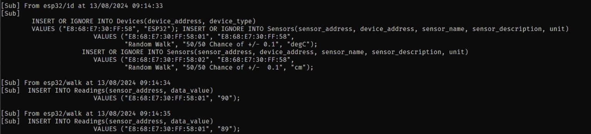
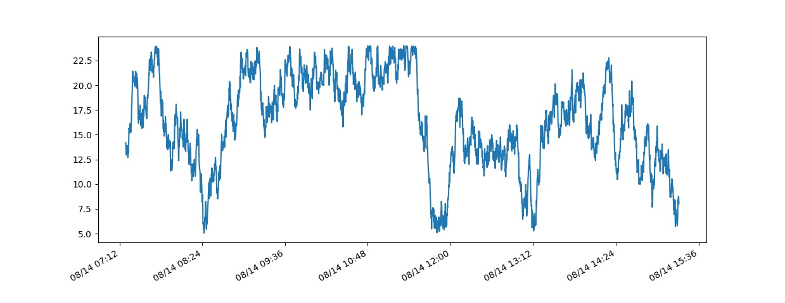

# ESP32 IoT communication using MQTT
[Documentation](https://mxwlc.github.io/esp32_iot/)
## About
The aim of the project was to communicate between an ESP32 microcontroller, a MQTT Broker Running on a raspberry pi
 and a desktop PC.

### Technologies Used
**Microcontroller** 
 - An `ESP32_DevKitc_v4` was used, this was chosen due to the inbuilt wifi and bluetooth capabilities
 - The Arduino framework was chosen as I am far more comfortable with the Arduino framework over ESP-IDF
 - All Code on the ESP32 is written in C++
 - The following Dependancies were used
    - `bblanchon/ArduinoJson@^7.1.0` For onboard JSON Encoding
	- `knolleary/PubSubClient@^2.8` for communicating with MQTT broker

**MQTT Broker**
 - The MQTT broker was run on a Raspberry Pi 3A+ using Mosquitto an open source MQTT broker
 - The RPI is running PiOs Headlessly

**Database**
 - The database is implemented using Sqlite3 this was chosen in order to prototype the system without having to Host a Database Server
 - The entire backend is written in python and makes use of the following libraries
   - `sqlite3` - C library that provides a lightweight disk based database
   - `json` - Library that can encode dictionaries into JSON Objects
   - `paho-mqtt` - Library that provides a class which enables applications to communicate with an MQTT Broker

## Usage

Once all the credentials are inplace and everything is setup all that needs to be done for the ESP32 to communicate with the RPI is just to Power the RPI and ESP32.

In order to start inserting recieved readings and ID packets into the database simply run the following command from within the virtual environment.
```bash
python server/mqtt_sub.py
```


Crude functionality to view the readings stored in the data base is available, simply run
```bash
python server/plot.py
```

## How to Install and Run
**Step 0** Install the prerequisites
- Python 
- PlatformIO
- C compiler
- Doxygen (Optional)
 
**Step 1** clone the Repository
```bash
git clone https://github.com/mxwlc/esp32_iot.git
```
**Step 2** Create a virtual Environment
```bash
python -m venv .venv
cd .venv/scripts
source activate
```
**Step 3**
Install Python Libraries
```bash
pip install -r requirements.txt
```
**Step 4**
Setup Mosquitto on a Raspberry Pi ([The Guide I used](https://randomnerdtutorials.com/how-to-install-mosquitto-broker-on-raspberry-pi/))

**Step 5** Replace variables with the correct values (Sensitive data such as IPs, SSIDs and router passwords have been replaced by X's)

**Step 6** Using PlatformIO build and flash the firmware onto the ESP32

**Step 7** Run `server/db/db.py` to generate the database and `server/mqtt_sub.py` to connect to the database and input data

## License
Distributed under the MIT Licesnse. See LICENSE.txt for more information.

